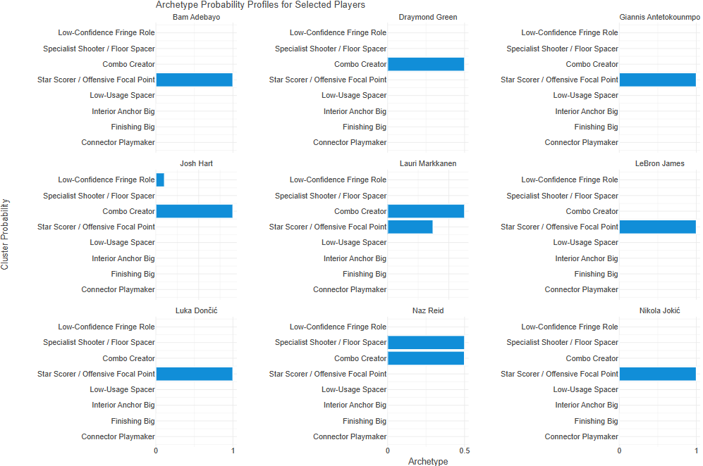

## Intro

The goal of this project was to create an unsupervised machine learning model that analyses 
and creates clusters of NBA players based on their per-game and advanced stats from a 
season. The groupings were analyzed and named based on the stat archetypes, and 
confirmed/adjusted based on players filled into that cluster. That model’s cluster archetypes 
were then applied to player stats of the 2024-25 season stats, to see where players landed. 
The purpose was to explore the positionless era of the NBA, and explore the uses of archetypes 
rather than position labels.  


## Conclusion

The finished model was an unsupervised Gaussian Mixture model, which allowed the model to 
create the groups for me, and for players to be partially in multiple groups, or entirely in 1 
group, however best fit. Only players who averaged over 12 minutes per game were used in 
the model, and it was trained on players’ season stats from the 2014-15 season to the 2022-23 
season (excluding Covid season 2019-20).  Here are some interesting players. 

<div style="text-align:center;">

{width=70%}


</div>

Bam Adebayo would be more predicted to be an Interior Anchor or Finishing Big, however 
ended up in the Star Scorer / Offensive Focal Point(Note: This is from last season, and this 
season he surprised many with his 83 point game, the second most points in an NBA game 
ever). Players like Draymond Green, Giannis Antetokounmpo, LeBron James, and Luka Dončić 
would be expected to be split between groups rather than into 1, but they each had a 1 
(rounded, since a couple other groups would get values like 6.3 * 10^-70 for a few other 
groups). Josh Hart, Lauri Markkanan and Naz Ried were some of the players who got more 
split between 2 main archetypes. Each has some Combo Creator to some degree. 


## Process


When trying to get data, the first option looked at was the NBA API. I am not very familiar with 
using APIs and as I asked AI to help me read in the data I was extremely confused. I eventually 
got something that worked, but after a time gap to work on module 6, coming back and still 
not understanding how it worked, I decided to scrap it, and go for another way I could 
understand. I started using data from the Basketball-Reference website, and I manually copied 
data from the 2014-15 season to 2025-26 season. Then I checked the terms of use, and it was 
specifically against being used for the training of machine learning models. So I had to reset 
again. At this point I decided to give the NBA API another try, and this time focus more time 
into understanding it along the way. I again had to ask AI for help with most code, but I asked 
it to break it down line by line, and this time, I was able to get it to work right away, and the 
data looked cleaner than the Basketball-Reference data I was about to use. Then AI helped me 
work through the process, checking the data along the way and commenting on the code so it 
stayed organized and readable(for most parts). Soon, I was able to get some functions that 
allowed me to read in multiple seasons that could be used as the training data for the model. 


While training the model, the final decision was to go with a model that created 8 clusters or 
archetype groupings. To evaluate the effectiveness of the model, I mainly used AIC and BIC 
values, which attempt to measure goodness of fit, but the values kept getting better as fewer 
clusters were tried(I also looked at a Silhouette value, Calinski value, Davies Bouldin value, and 
cluster size, I ended up caring more about the cluster size, than any of the actual values for 
model fit). After looking at 5 clusters, similar to the original 5 positions, and seeing the 
groupings it made, the created groups were doing a poor job of creating specific archetypes, 
and the broader groups were harder to interpret or use. So while the evaluation methods 
always recommended less clusters, I decided to use 8 anyway. There did always seem to be a 
cluster that seemed odd, with big names that didn’t match the lesser-known players in the 
same group. I suspect this is at least partially from the fact that season data and not career 
data was used, and these bigger-name players were in other groups for most seasons, but for 
a season here or there, struggling with injuries, or while still young before their prime, leading 
to their name popping up in this group that ended up being named “Low Confidence Fringe 
Role”. But after deciding the 8 labels for the groups, the model was applied to the test data 
(2024-25 season), and the results were analysed and displayed. 


## References
```{r}
# All code done in python.
# A Lot more AI assisted/generated segments of code for this project.
# Will be shared in the google colab.
```


[Google Colab of Code](https://colab.research.google.com/drive/1RavESW9hk4cJ3KlurhgUpAhrJ7v2tpBY?usp=sharing)
